# 🏥 Hospital Management System

A comprehensive **Hospital Management System** developed using **Java**, **Java Swing**, and **MySQL**. This desktop application streamlines hospital operations by providing an intuitive interface for managing patients, doctors, appointments, billing, departments, and other administrative tasks.

This project was developed as an academic project and serves as the foundation for future enhancements, including a **cross-platform mobile application** built with **Flutter** and **Dart** for **Android** and **iOS**.

---

## ✨ Features

- 🔐 Secure Login System
- 🏥 Reception Dashboard
- 👨‍⚕️ Doctor Management
- 🧑 Patient Registration
- 📝 Patient Information Management
- ✏️ Update Patient Details
- 🛏️ Hospital Bed Availability
- 🔍 Search Available Rooms
- 🚪 Search Occupied Rooms
- 📋 Department Information
- 👨‍💼 Employee Information
- 🚑 Ambulance Information
- 💳 Billing & Discharge Management
- 🤖 Hospital ChatBot
- 🚪 Secure Logout
- 🗄️ MySQL Database Integration
- 🖥️ Java Swing GUI

---

## 🛠️ Tech Stack

| Technology | Purpose |
|------------|---------|
| Java | Programming Language |
| Java Swing | Desktop User Interface |
| MySQL | Database Management |
| JDBC | Database Connectivity |
| IntelliJ IDEA | Development Environment |
| Git & GitHub | Version Control |

---

## 📂 Project Structure

```text
Hospital_Management_System/
│
├── src/
├── Screenshots/
├── database/
├── resources/
├── README.md
└── LICENSE
```

---

## 🚀 Getting Started

### Prerequisites

- Java JDK 17 or later
- MySQL Server
- IntelliJ IDEA (or any Java IDE)
- MySQL JDBC Driver

### Installation

1. Clone the repository

```bash
git clone https://github.com/pramesh61/Hospital_Management_System.git
```

2. Open the project in IntelliJ IDEA.

3. Create a MySQL database.

4. Import the SQL database file.

5. Configure the database connection.

Example:

```java
String url = "jdbc:mysql://localhost:3306/hospital_management";
String username = "pramesh";
String password = "9748421356";
```

6. Add the MySQL JDBC Driver.

7. Build and run the project.

---

# 📸 Application Screenshots

## 🔐 Login

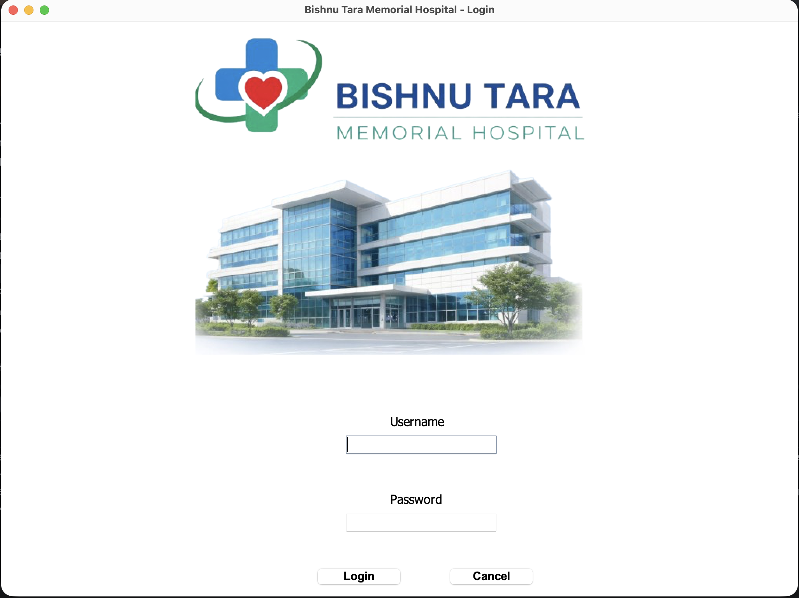

---

## 🏥 Reception Section

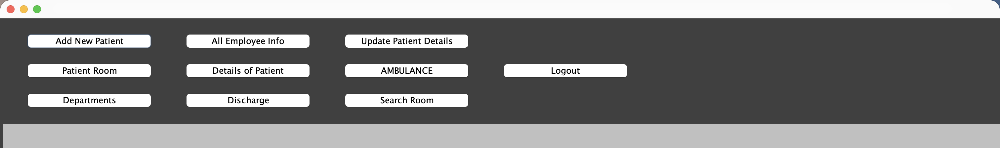

---

## 📝 New Patient Form

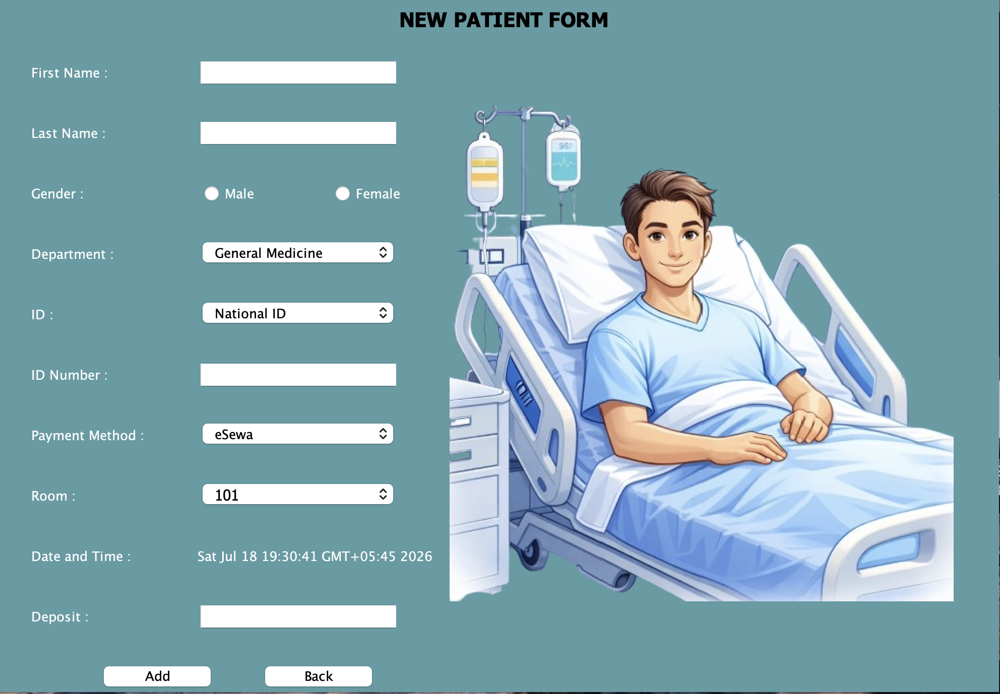

---

## 📋 Patient Registration List

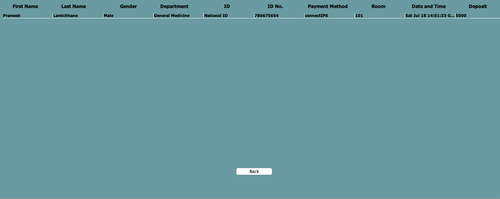

---

## ✅ Patient Added Confirmation


---

## ✏️ Update Patient Details

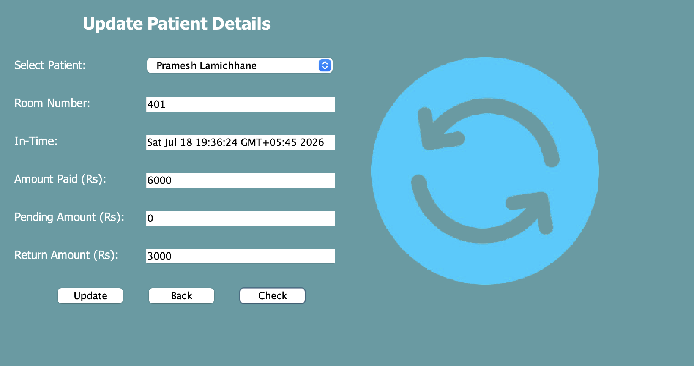

---

## 🛏️ Hospital Bed Availability

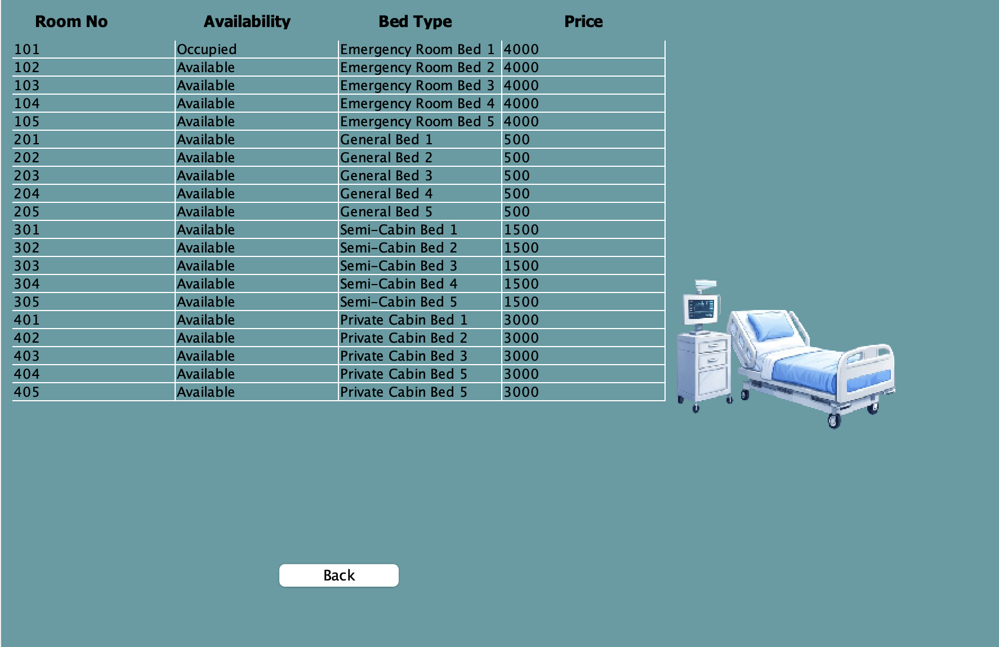

---

## 🔍 Search Available Rooms

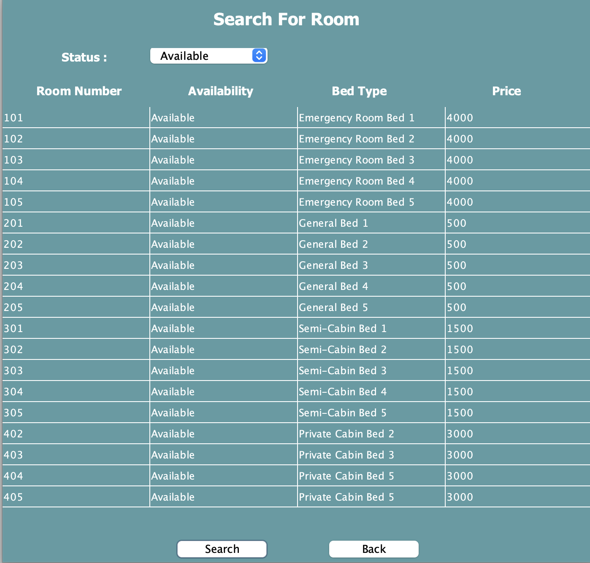

---

## 🚪 Search Occupied Rooms

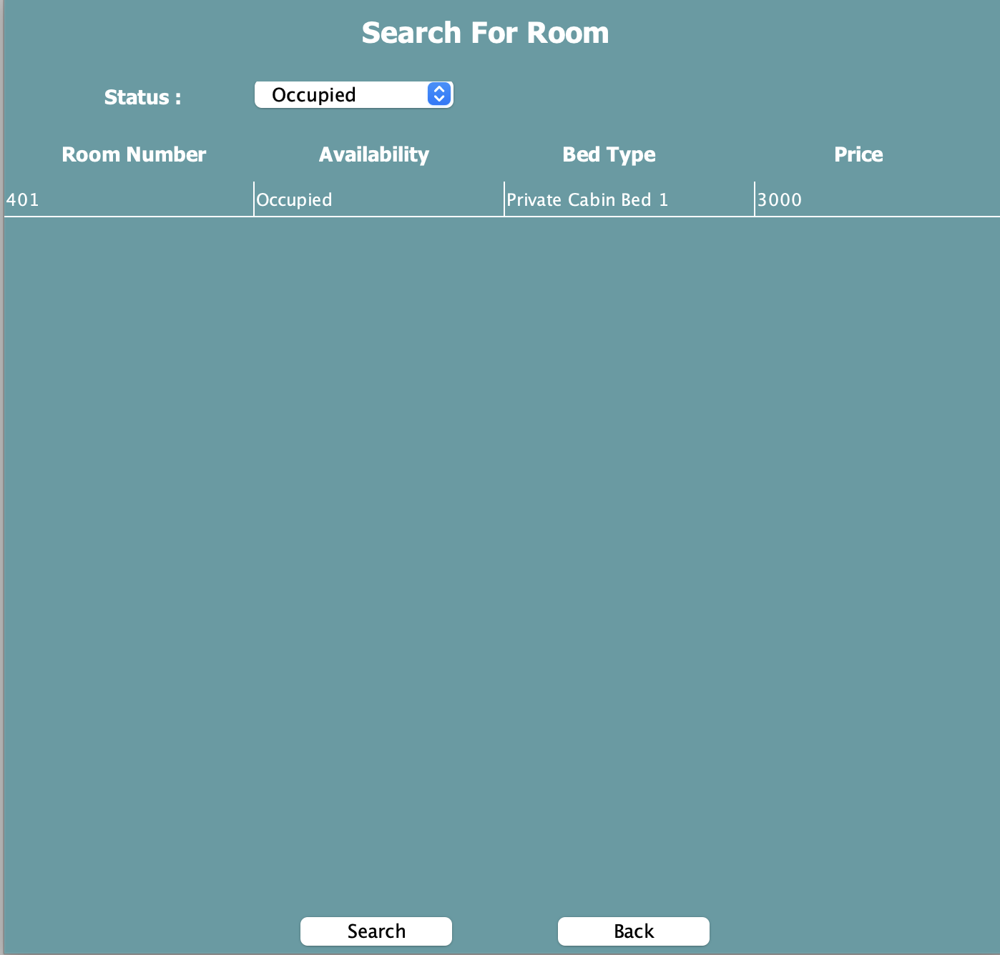

---

## 🏢 Department Information

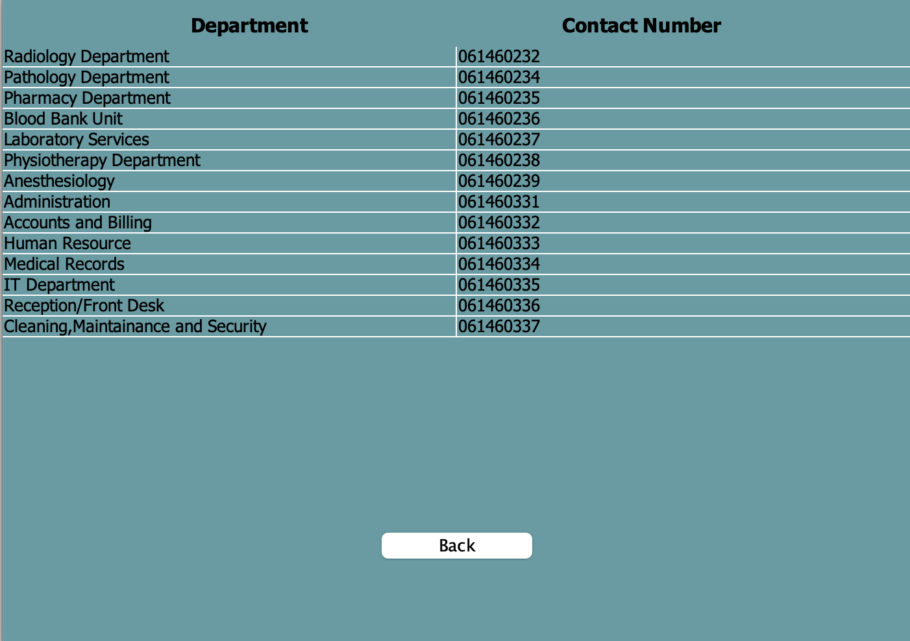

---

## 👨‍💼 Employee Information

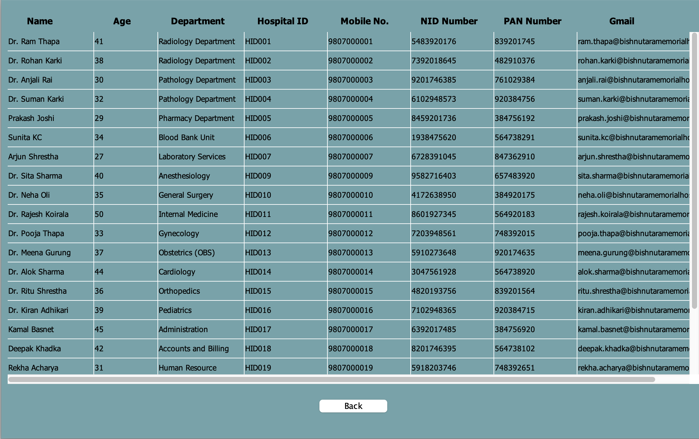

---

## 🚑 Ambulance Information

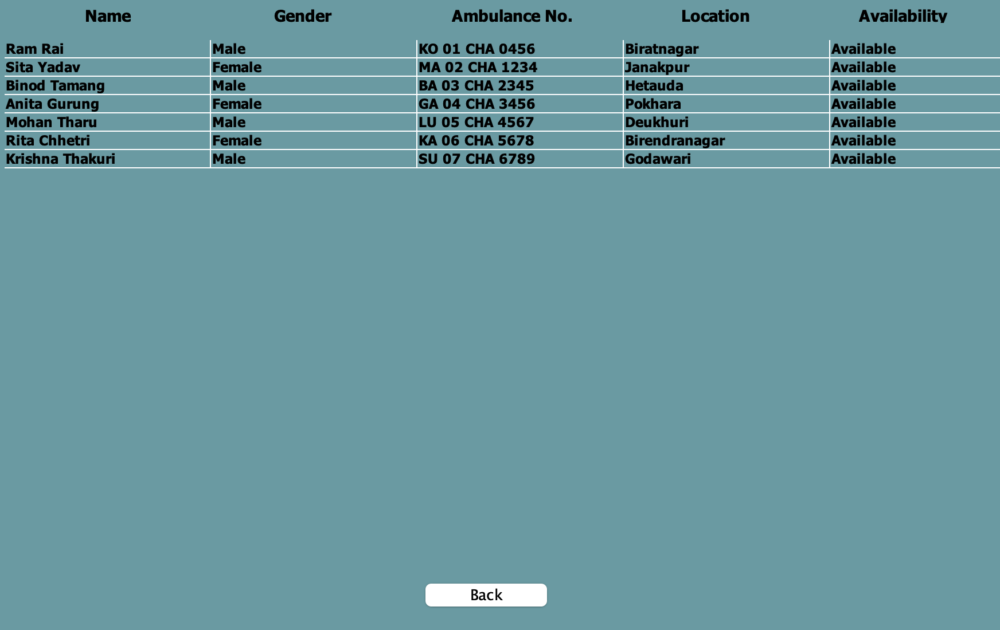

---

## 📄 Discharge Details

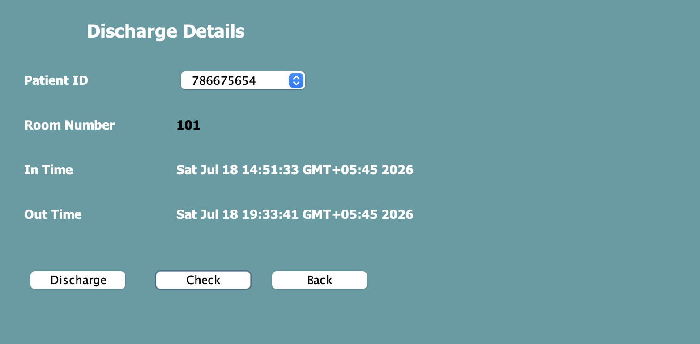

---

## ✅ Patient Discharge Confirmation

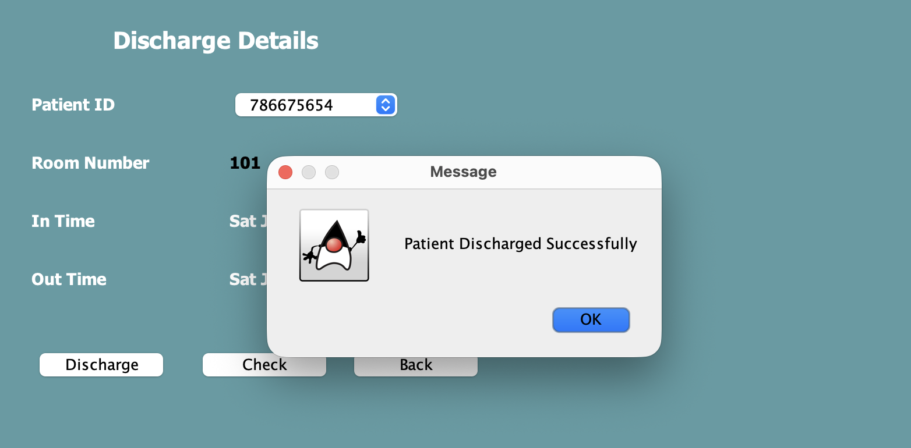

---

## 🤖 Hospital ChatBot

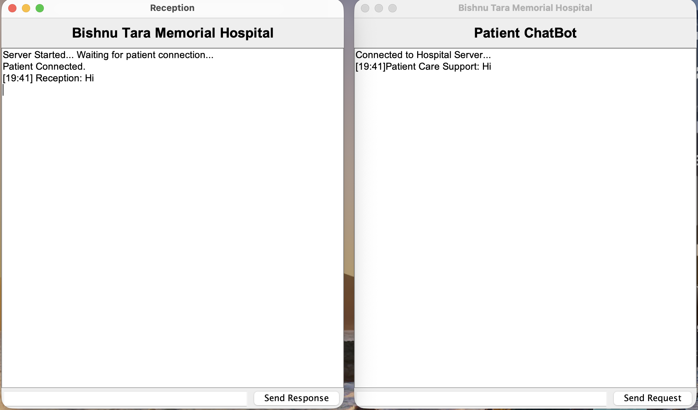

---

## 🚪 Logout Confirmation

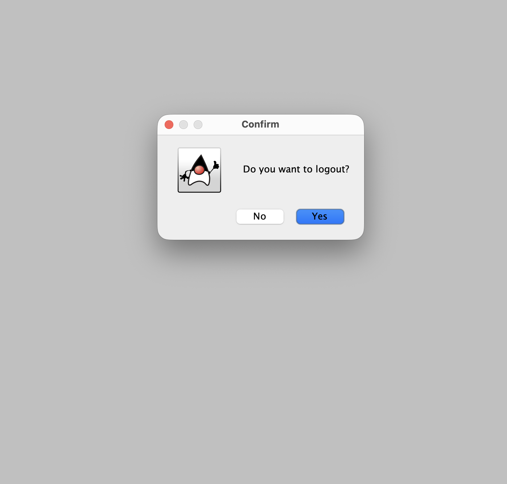

---

## 🏗️ Project Code Structure

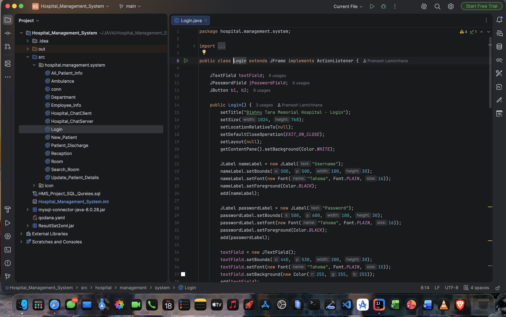

---

## 📋 Modules

- Authentication
- Reception Management
- Patient Management
- Doctor Management
- Department Management
- Employee Management
- Room Management
- Bed Management
- Ambulance Management
- Billing & Discharge
- ChatBot
- Reports

---

## 🎯 Objectives

- Digitize hospital administration
- Reduce paperwork
- Improve patient record management
- Simplify hospital workflow
- Enhance operational efficiency
- Provide a clean and user-friendly interface

---

## 🗺️ Future Roadmap

The project is continuously evolving with the following planned improvements:

- 📱 Flutter mobile application
- 🤖 Android & iOS support
- ☁️ Cloud database integration
- 🌐 REST API backend
- 📅 Online appointment booking
- 🔔 Push notifications
- 📂 Electronic Medical Records (EMR)
- 📊 Analytics Dashboard
- 🧾 PDF Report Generation
- 👥 Multi-user Role Management
- 🔒 Enhanced Authentication & Security
- 🌍 Multi-language Support
- 🔄 Desktop & Mobile Data Synchronization

---

## 🤝 Contributing

Contributions are welcome!

1. Fork this repository.
2. Create a new feature branch.

```bash
git checkout -b feature-name
```

3. Commit your changes.

```bash
git commit -m "Add new feature"
```

4. Push to GitHub.

```bash
git push origin feature-name
```

5. Open a Pull Request.

---

## 👨‍💻 Author

**Pramesh Lamichhane**

- GitHub: https://github.com/pramesh61

---

## 📄 License

This project is developed for educational and learning purposes.

Feel free to fork, improve, and contribute.

---

## ⭐ Support

If you found this project helpful, please consider giving it a **⭐ Star** on GitHub.

Your support encourages future development and helps others discover the project.
